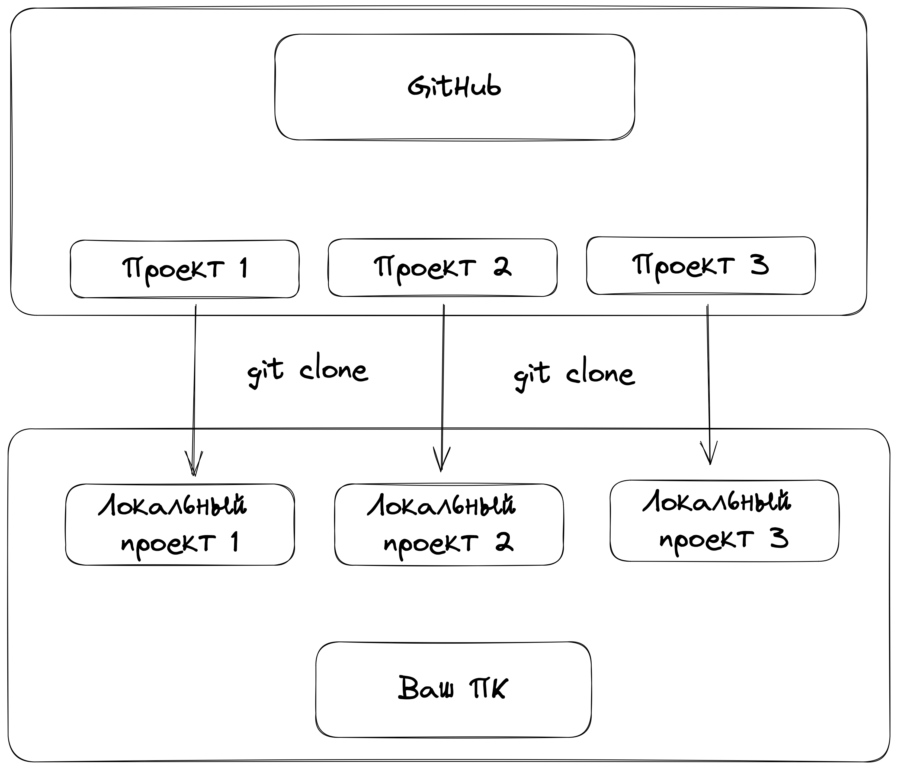
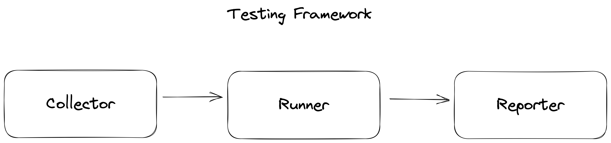
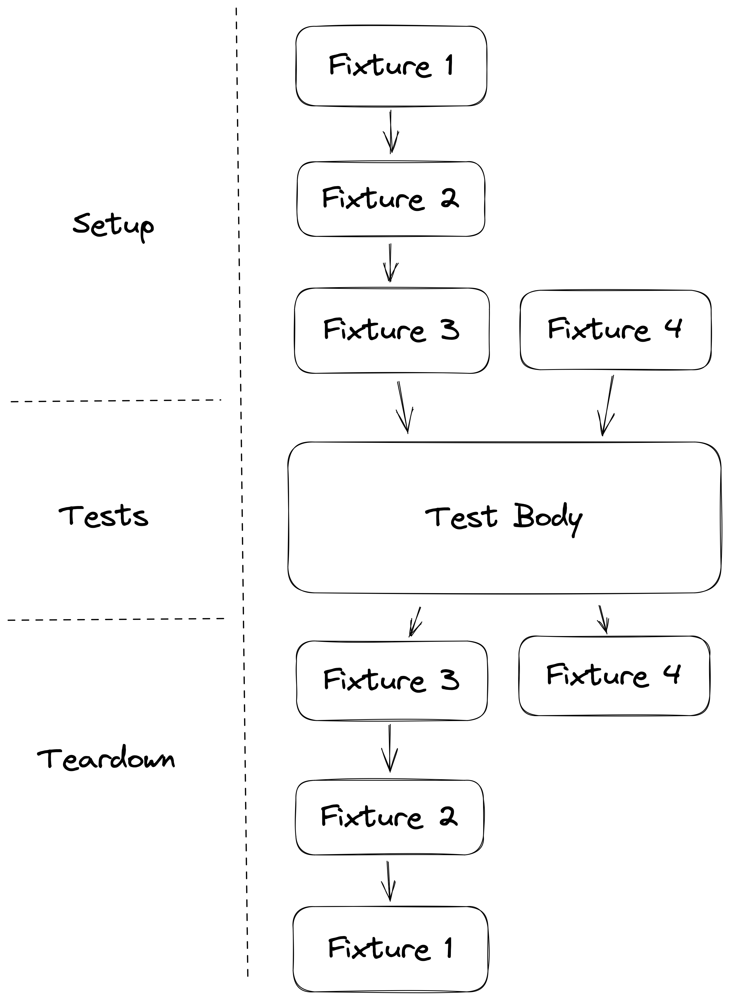

# qa_guru_python_4_2

Hello, qa-guru!

Эта строчка добавлена из локальной IDE

# Домашняя работа
1. Зарегистрируйте аккаунт на https://github.com
2. Создайте новый проект для домашнего задания https://github.com/new
3. Доработайте тест на поиск в google с первого занятия с Pytest
4. Выставите размер браузера с помощью фикстуры Pytest
5. Добавьте еще один тест на поисковой запрос, по которому нет никаких резульатов:
   - вводим уникальную строку, по которой не должно ничего найтись
   - проверяем, что результатов нет
   - проверяем, что присутствует информационное сообщение об этом

Запушьте код в свой репозиторий и дайте на него ссылку в качестве ответа на домашнее задание

## GitHub и локальные проекты

## Типичный тестовый фреймворк

## Дерево фикстур

